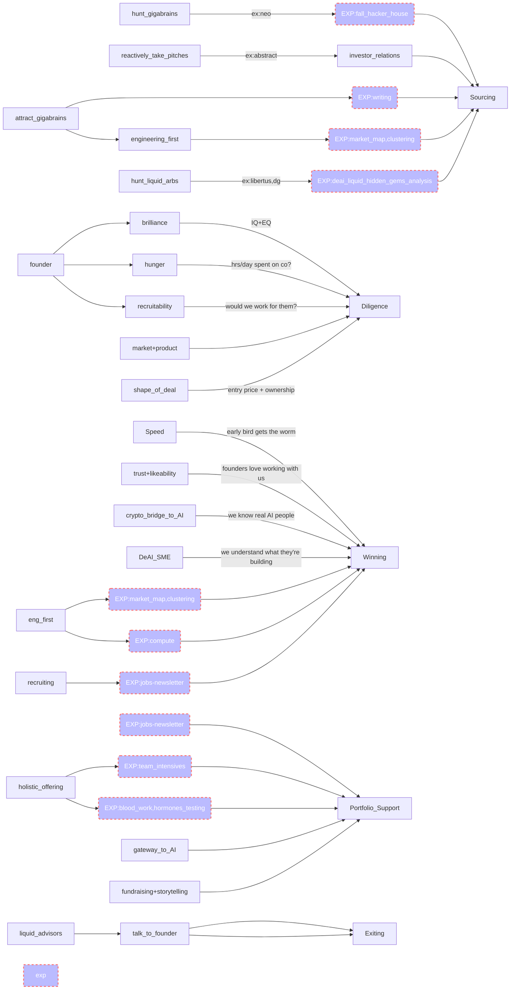

# topology-strategy

```mermaid
graph LR
  hunt_gigabrains -- ex:neo --> exp8(EXP:fall_hacker_house) --> Sourcing
  reactively_take_pitches -- ex:abstract --> investor_relations --> Sourcing
  attract_gigabrains --> exp6(EXP:writing) --> Sourcing
  attract_gigabrains --> engineering_first --> exp0(EXP:market_map,clustering) --> Sourcing

  hunt_liquid_arbs -- ex:libertus,dg --> exp7(EXP:deai_liquid_hidden_gems_analysis) --> Sourcing
  founder --> brilliance -- IQ+EQ --> Diligence
  founder --> hunger -- hrs/day spent on co? --> Diligence
  founder --> recruitability -- would we work for them? --> Diligence
  market+product --> Diligence
  shape_of_deal -- entry price + ownership --> Diligence
  Speed -- early bird gets the worm --> Winning
  trust+likeability -- founders love working with us --> Winning
  crypto_bridge_to_AI -- we know real AI people --> Winning
  DeAI_SME -- we understand what they're building --> Winning
  eng_first --> exp9(EXP:market_map,clustering) --> Winning
  eng_first --> exp1(EXP:compute) --> Winning
  recruiting --> exp2(EXP:jobs-newsletter) --> Winning
  exp3(EXP:jobs-newsletter) --> Portfolio_Support
  holistic_offering --> exp4(EXP:team_intensives) --> Portfolio_Support
  holistic_offering --> exp5(EXP:blood_work,hormones_testing) --> Portfolio_Support
  gateway_to_AI --> Portfolio_Support
  fundraising+storytelling --> Portfolio_Support
  liquid_advisors --> talk_to_founder --> Exiting
  talk_to_founder --> Exiting

style exp fill:#bbf,stroke:#f66,stroke-width:2px,color:#fff,stroke-dasharray: 5 5
style exp0 fill:#bbf,stroke:#f66,stroke-width:2px,color:#fff,stroke-dasharray: 5 5
style exp1 fill:#bbf,stroke:#f66,stroke-width:2px,color:#fff,stroke-dasharray: 5 5
style exp2 fill:#bbf,stroke:#f66,stroke-width:2px,color:#fff,stroke-dasharray: 5 5
style exp3 fill:#bbf,stroke:#f66,stroke-width:2px,color:#fff,stroke-dasharray: 5 5
style exp4 fill:#bbf,stroke:#f66,stroke-width:2px,color:#fff,stroke-dasharray: 5 5
style exp5 fill:#bbf,stroke:#f66,stroke-width:2px,color:#fff,stroke-dasharray: 5 5
style exp6 fill:#bbf,stroke:#f66,stroke-width:2px,color:#fff,stroke-dasharray: 5 5
style exp7 fill:#bbf,stroke:#f66,stroke-width:2px,color:#fff,stroke-dasharray: 5 5
style exp8 fill:#bbf,stroke:#f66,stroke-width:2px,color:#fff,stroke-dasharray: 5 5
style exp9 fill:#bbf,stroke:#f66,stroke-width:2px,color:#fff,stroke-dasharray: 5 5


```
